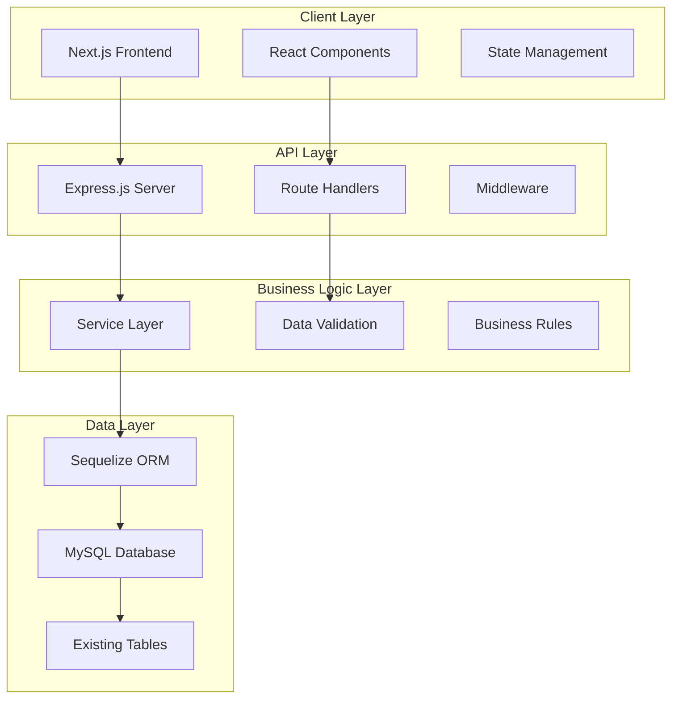

# CRM MVP Design Document

## Overview

Bu tasarım dokümanı, mevcut MySQL veritabanını kullanan CRM sisteminin MVP versiyonu için teknik mimarisini tanımlar. Sistem, Next.js frontend ve Express.js backend kullanarak modern bir web uygulaması olarak geliştirilecektir. MVP'nin temel amacı, kullanıcıların merkezi müşteri yönetimi ve satış takibi yapabilmesini sağlamaktır.

### Technology Stack

**Frontend:**
- Next.js 14 (React 18 tabanlı)
- TypeScript
- Tailwind CSS
- React Hook Form + Zod validation
- Axios (API calls)
- React Query (data fetching)
- React Hot Toast (notifications)

**Backend:**
- Node.js + Express.js
- Sequelize ORM
- MySQL database
- JWT authentication (MVP için devre dışı)
- bcryptjs (password hashing)

## Architecture

### System Architecture



### Database Schema (Existing)

Sistem mevcut MySQL veritabanı şemasını kullanacak:

- **USER**: Kullanıcı bilgileri
- **CONTACT**: Müşteri/kişi bilgileri  
- **CONTACTEMAIL**: Kişi email adresleri
- **CONTACTPHONE**: Kişi telefon numaraları
- **OPPORTUNITY**: Satış fırsatları
- **TASK**: Görevler
- **CONTACTFIELDVALUE**: Özel alanlar

## Components and Interfaces

### Frontend Components

#### 1. Layout Components
- **MainLayout**: Ana sayfa düzeni, navigasyon ve header
- **Navigation**: Sol menü veya üst navigasyon
- **Header**: Kullanıcı bilgisi ve sistem durumu

#### 2. Contact Components
- **ContactList**: Kişi listesi ve arama
- **ContactCard**: Kişi özet kartı
- **ContactDetail**: Detaylı kişi görüntüleme
- **ContactSearch**: Arama ve filtreleme

#### 3. Opportunity Components
- **OpportunityList**: Fırsat listesi
- **OpportunityCard**: Fırsat özet kartı
- **OpportunityDetail**: Fırsat detayları

#### 4. Task Components
- **TaskList**: Görev listesi
- **TaskCard**: Görev kartı
- **TaskStatusBadge**: Durum göstergesi
- **TaskGrouping**: Duruma göre gruplama

#### 5. Common Components
- **LoadingSpinner**: Yükleme göstergesi
- **ErrorMessage**: Hata mesajları
- **Pagination**: Sayfalama
- **SearchInput**: Arama girişi

### Backend API Endpoints

#### Authentication (MVP için basitleştirilmiş)
- `GET /api/auth/current` - Otomatik admin kullanıcı döndürme

#### Contacts
- `GET /api/contacts` - Kişi listesi (arama ve sayfalama)
- `GET /api/contacts/:id` - Kişi detayı
- `GET /api/contacts/:id/emails` - Kişi email adresleri
- `GET /api/contacts/:id/phones` - Kişi telefon numaraları
- `GET /api/contacts/:id/opportunities` - Kişiye ait fırsatlar
- `GET /api/contacts/:id/tasks` - Kişiye ait görevler

#### Opportunities
- `GET /api/opportunities` - Fırsat listesi
- `GET /api/opportunities/:id` - Fırsat detayı

#### Tasks
- `GET /api/tasks` - Kullanıcı görevleri
- `GET /api/tasks/overdue` - Geciken görevler
- `GET /api/tasks/today` - Bugün bitirilmesi gereken görevler

#### Users
- `GET /api/users/current` - Mevcut kullanıcı bilgisi

### Data Transfer Objects (DTOs)

#### ContactDTO
```typescript
interface ContactDTO {
  id: number;
  name: string;
  type: string[];
  jobTitle?: string;
  address?: string;
  city?: string;
  country?: string;
  emails: ContactEmailDTO[];
  phones: ContactPhoneDTO[];
  opportunities: OpportunityDTO[];
  tasks: TaskDTO[];
}
```

#### OpportunityDTO
```typescript
interface OpportunityDTO {
  id: number;
  name: string;
  finalTotal?: string;
  currency?: string;
  statusTypeId?: number;
  contactName: string;
  ownerName: string;
  datetime: Date;
}
```

#### TaskDTO
```typescript
interface TaskDTO {
  id: number;
  note?: string;
  status: 'New' | 'In progress' | 'Completed';
  datetimeDue?: Date;
  contactName?: string;
  opportunityName?: string;
  isOverdue: boolean;
}
```

## Data Models

### Sequelize Model Enhancements

Mevcut modeller şu şekilde geliştirilecek:

#### Contact Model
- Arama metodları (searchByName, searchByJobTitle)
- İlişkili veri getirme metodları
- Sayfalama desteği

#### User Model  
- Admin kullanıcı otomatik seçimi
- Güvenlik metodları (password hashing)

#### Task Model
- Durum bazlı filtreleme
- Geciken görev tespiti
- Gruplama metodları

#### Opportunity Model
- Para birimi formatlaması
- Durum bazlı filtreleme

### Database Queries Optimization

- **Eager Loading**: İlişkili verileri tek sorguda getirme
- **Pagination**: Büyük veri setleri için sayfalama
- **Indexing**: Arama performansı için indeksler
- **Query Caching**: Sık kullanılan sorguları önbellekleme

## Error Handling

### Frontend Error Handling
- **API Error Interceptor**: Axios ile merkezi hata yakalama
- **Error Boundaries**: React hata sınırları
- **User-Friendly Messages**: Kullanıcı dostu hata mesajları
- **Retry Mechanisms**: Başarısız istekleri yeniden deneme

### Backend Error Handling
- **Global Error Handler**: Express middleware ile merkezi hata yönetimi
- **Validation Errors**: Giriş verisi doğrulama hataları
- **Database Errors**: Veritabanı bağlantı ve sorgu hataları
- **HTTP Status Codes**: Uygun HTTP durum kodları

### Error Response Format
```typescript
interface ErrorResponse {
  success: false;
  message: string;
  code?: string;
  details?: any;
  timestamp: string;
}
```

## Testing Strategy

### Frontend Testing
- **Unit Tests**: Component testleri (Jest + React Testing Library)
- **Integration Tests**: API entegrasyonu testleri
- **E2E Tests**: Kullanıcı senaryoları (Cypress - opsiyonel)

### Backend Testing
- **Unit Tests**: Service ve model testleri (Jest)
- **Integration Tests**: API endpoint testleri (Supertest)
- **Database Tests**: Model ve ilişki testleri

### Test Coverage Goals
- Backend: %80+ kod kapsamı
- Frontend: %70+ kod kapsamı
- Critical paths: %95+ kod kapsamı

## Security Considerations

### MVP Security Measures
- **Input Validation**: Tüm giriş verilerinin doğrulanması
- **SQL Injection Prevention**: Parameterized queries
- **XSS Prevention**: Output encoding
- **CORS Configuration**: Güvenli cross-origin istekleri
- **Rate Limiting**: API isteklerinin sınırlandırılması

### Data Protection
- **Sensitive Data Masking**: Şifre alanlarının gizlenmesi
- **Audit Logging**: Kritik işlemlerin loglanması
- **Error Information**: Hata mesajlarında hassas bilgi sızıntısının önlenmesi

## Performance Optimization

### Frontend Performance
- **Code Splitting**: Next.js otomatik kod bölme
- **Image Optimization**: Next.js image optimization
- **Caching**: React Query ile veri önbellekleme
- **Lazy Loading**: Bileşenlerin gecikmeli yüklenmesi

### Backend Performance
- **Database Connection Pooling**: Bağlantı havuzu yönetimi
- **Query Optimization**: Efficient database queries
- **Response Compression**: Gzip compression
- **Pagination**: Large dataset handling

### Monitoring
- **Response Time Tracking**: API yanıt süresi izleme
- **Error Rate Monitoring**: Hata oranı takibi
- **Database Performance**: Sorgu performansı izleme

## Deployment Architecture

### Development Environment
- **Local Development**: Docker Compose ile local setup
- **Hot Reloading**: Frontend ve backend hot reload
- **Database**: Local MySQL instance

### Production Considerations (Future)
- **Container Deployment**: Docker containerization
- **Load Balancing**: Multiple instance support
- **Database Scaling**: Read replicas
- **CDN Integration**: Static asset delivery

## API Design Principles

### RESTful Design
- **Resource-based URLs**: `/api/contacts`, `/api/opportunities`
- **HTTP Methods**: GET, POST, PUT, DELETE
- **Status Codes**: Appropriate HTTP status codes
- **Consistent Response Format**: Standardized API responses

### Response Format
```typescript
interface SuccessResponse<T> {
  success: true;
  data: T;
  pagination?: PaginationInfo;
  timestamp: string;
}

interface PaginationInfo {
  page: number;
  limit: number;
  total: number;
  totalPages: number;
}
```

### Request/Response Examples

#### Get Contacts
```
GET /api/contacts?search=john&page=1&limit=20

Response:
{
  "success": true,
  "data": [
    {
      "id": 1,
      "name": "John Doe",
      "type": ["Person"],
      "jobTitle": "Manager",
      "city": "Istanbul"
    }
  ],
  "pagination": {
    "page": 1,
    "limit": 20,
    "total": 150,
    "totalPages": 8
  },
  "timestamp": "2024-01-15T10:30:00Z"
}
```

## User Experience Design

### Navigation Flow
1. **Dashboard/Home** → Sistem özeti ve hızlı erişim
2. **Contacts** → Kişi listesi → Kişi detayı
3. **Opportunities** → Fırsat listesi → Fırsat detayı  
4. **Tasks** → Görev listesi (duruma göre gruplu)

### Responsive Design
- **Mobile First**: Mobil cihazlar öncelikli tasarım
- **Breakpoints**: sm (640px), md (768px), lg (1024px), xl (1280px)
- **Touch Friendly**: Mobil dokunmatik arayüz

### Loading States
- **Skeleton Loading**: İçerik yüklenirken iskelet gösterimi
- **Progressive Loading**: Aşamalı veri yükleme
- **Optimistic Updates**: Kullanıcı deneyimi için iyimser güncellemeler

## Internationalization (Future)

### Language Support Structure
- **i18n Framework**: Next.js built-in i18n
- **Language Files**: JSON-based translation files
- **Dynamic Loading**: Language-specific resource loading
- **RTL Support**: Right-to-left language support preparation

## Accessibility

### WCAG Compliance
- **Keyboard Navigation**: Tam klavye erişilebilirliği
- **Screen Reader Support**: ARIA labels ve descriptions
- **Color Contrast**: WCAG AA uyumlu renk kontrastı
- **Focus Management**: Odak yönetimi

### Semantic HTML
- **Proper Headings**: H1-H6 hiyerarşisi
- **Form Labels**: Tüm form elemanları için etiketler
- **Alt Text**: Görseller için alternatif metinler